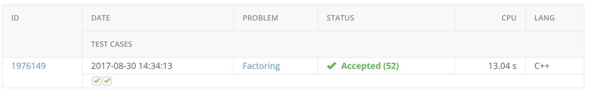
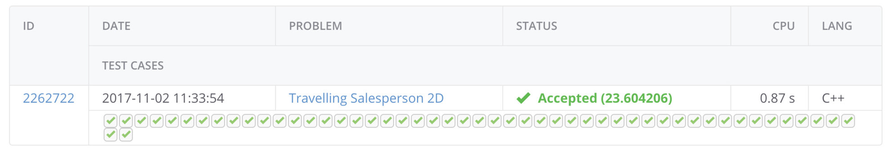

# KTH-AdvancedAlgorithms

This repo contains my implemented solutions for the labs in the course DD2440 Advanced Algorithms taken at KTH, Royal Institute of Technology. The course contents can be found [here](https://www.kth.se/student/kurser/kurs/DD2440?l=en). The labs are the following.

1. Traveling Salesman Problem
2. Prime Number Factorization

### Score preview

---

